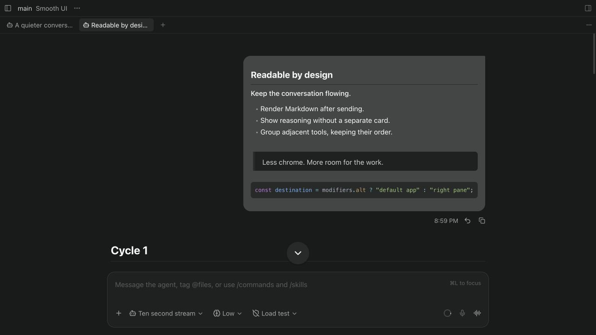
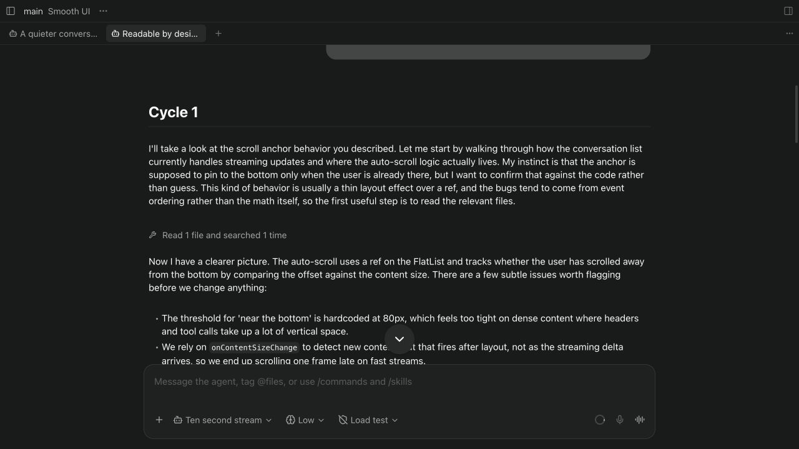
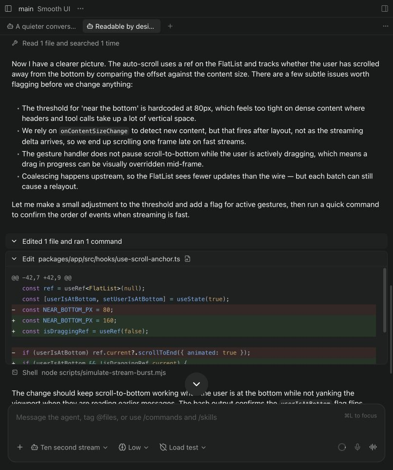
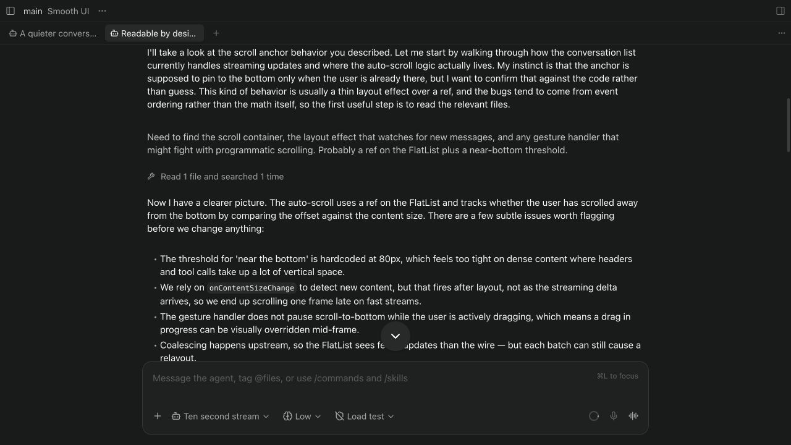
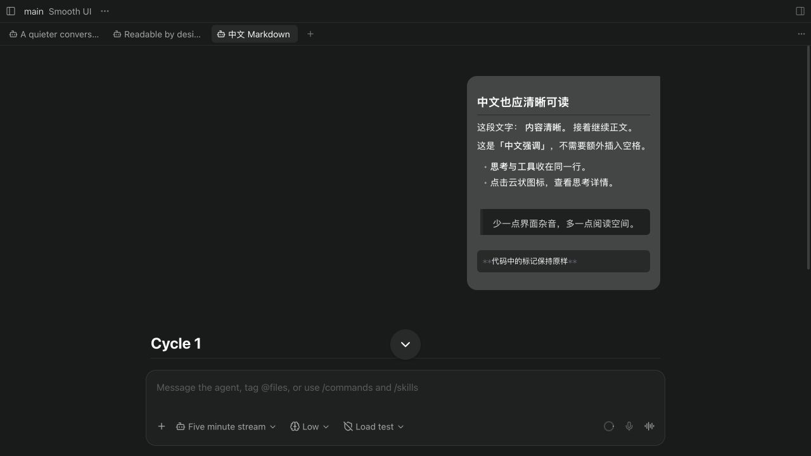

# Rendered examples

These are actual captures of the modified Paseo renderer using an isolated local mock provider.
All conversation text and tool activity are synthetic. They illustrate presentation, not completed
coding work. No real user conversation is included.

## Sent Markdown

Headings, emphasis, lists, quotes and code blocks render after sending. The composer and copy action
keep the Markdown source.



## Activity → tools → thinking details

Three actual UI states, held for readability: collapsed activity, tool/thinking rows, then provider
reasoning details. This step-through GIF illustrates the interaction, not animation timing.



## Reasoning and adjacent tools

Reasoning and adjacent tools collapse into a single summary. Expand it to see the Markdown
reasoning rows and individual tool calls in chronological order; normal replies stay outside.
Reasoning has a cloud icon and the same spacing as tools. Click its row to read the provider details.





## Try it

Paste this into the composer and send it:

````markdown
## Readable by design

**Keep the conversation flowing.**

- Render Markdown after sending.
- Show reasoning without a separate card.
- Group adjacent tools, keeping their order.

> Less chrome. More room for the work.

```ts
const destination = modifiers.alt ? "default app" : "right pane";
```
````

In a local desktop workspace, click a file link such as `[README](README.md)` in an assistant message:
normal click follows Layout, Command/Ctrl locates it in the file manager, and Option/Alt opens it
with the system default application. The mappings are configurable in Settings → Layout.

## Chinese emphasis



These also render as bold in sent messages and assistant replies:

```markdown
这是**中文。**后续说明。
这段文字： **内容清晰。 **接着继续正文。
```

The source and code spans remain unchanged when copied.
